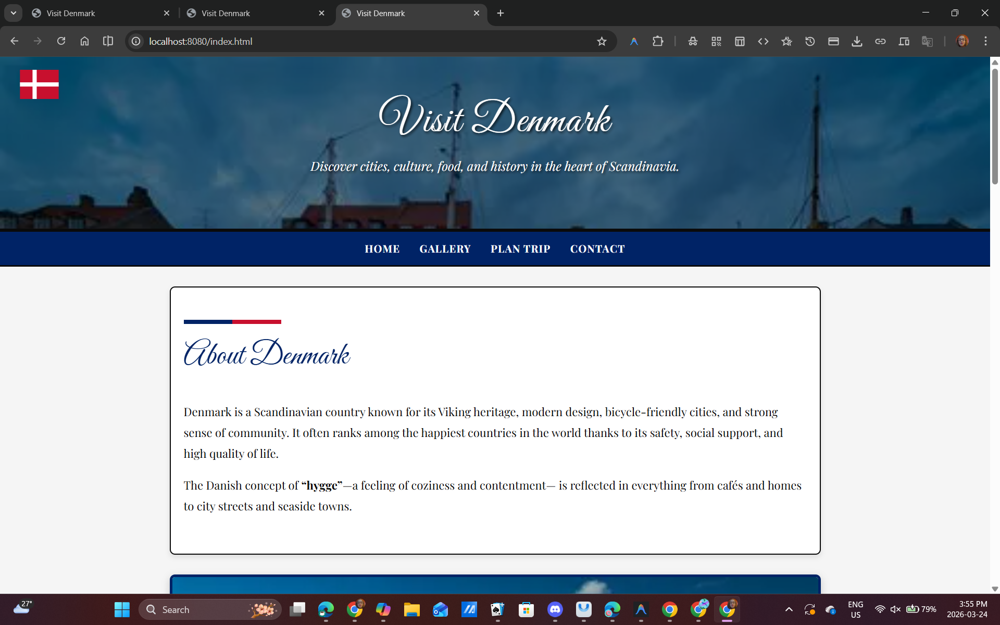
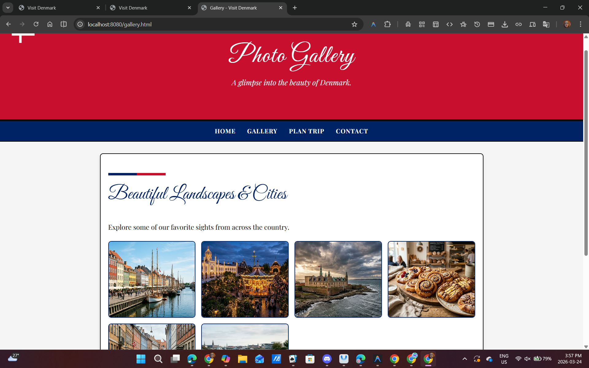
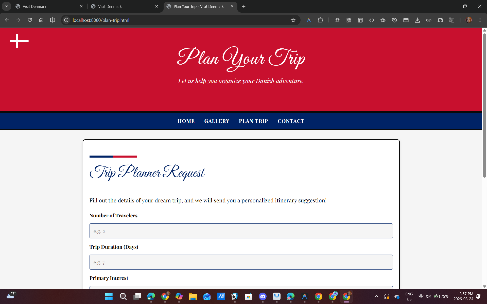
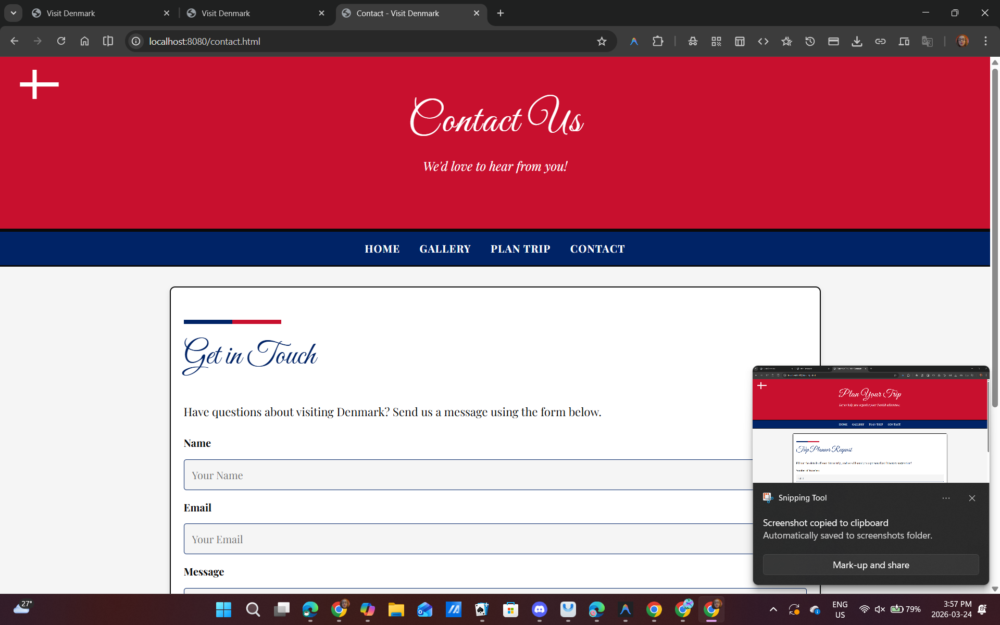

# Visit Denmark 🇩🇰
An educational and visually stunning website showcasing the tourism, attractions, and culture of Denmark! 

## Screenshots

## Features
- **Responsive Design**: Adapts beautifully to desktop and mobile screens.
- **Dynamic Theme**: Employs a stylized "Denmark Flag" color palette (deep blue, rich red, and true black) alongside elegant calligraphy typography.
- **Multiple Pages**:
  - `index.html`: Home page featuring about section, top cities, attractions, and food recommendations.
  - `gallery.html`: Photo gallery showcasing beautiful AI-generated imagery of Copenhagen and classic Danish features.
  - `plan-trip.html`: An interactive form to help you organize your upcoming adventure to Scandinavia.
  - `contact.html`: A contact form to get in touch with our team.
- **Interactive Forms**: User-friendly `<form>` elements available for easy inquiries.

## Installation
Since this project uses static HTML/CSS files, there is no build step required.
1. Clone this repository or download the ZIP file.
2. Open `index.html` in any web browser of your choice.

## Technologies Used
- HTML5
- Vanilla CSS3
- Google Fonts (`Great Vibes` and `Playfair Display`)

## License
This project is licensed under the MIT License - see the `LICENSE` file for details.
