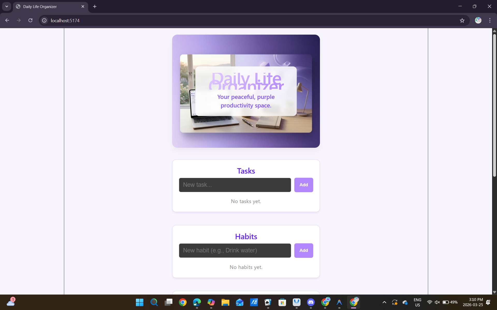
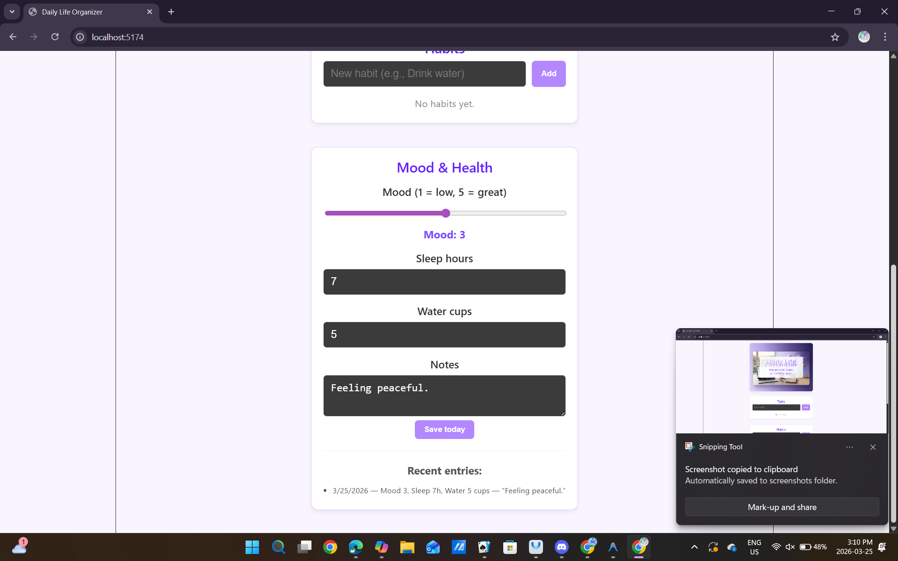

# Daily Life Organizer

A purple-themed daily planner, habit tracker, and mood & health logger built with React.

## Screenshots




## Features

- ✅ Today’s tasks (add, complete, persistent via localStorage)
- ✅ Habits with daily completion and streaks
- ✅ Mood, sleep, water, and notes with history
- 🎨 Unified purple gradient theme

## Tech Stack

- React (functional components + hooks)
- localStorage for persistence
- CSS for theming

## Run locally

```bash
npm install
npm run dev
```

## Project Structure

- `src/App.jsx` – navigation + layout
- `src/components/Tasks.jsx` – daily tasks
- `src/components/Habits.jsx` – habits + streaks
- `src/components/MoodHealth.jsx` – mood & health history
- `src/App.css` – purple theme + layout

## Future Ideas

- Calendar view for mood & habit history  
- PWA support (installable on mobile)  
- Sync with a backend for multi-device use
